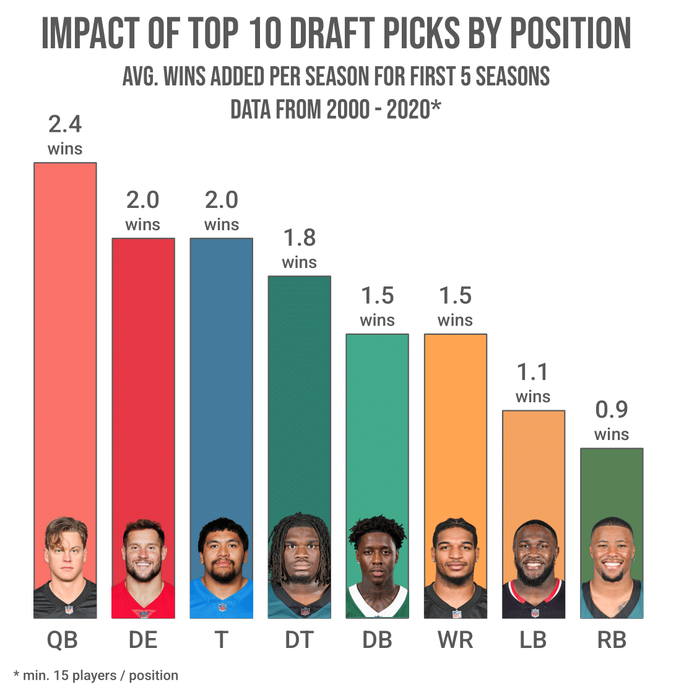
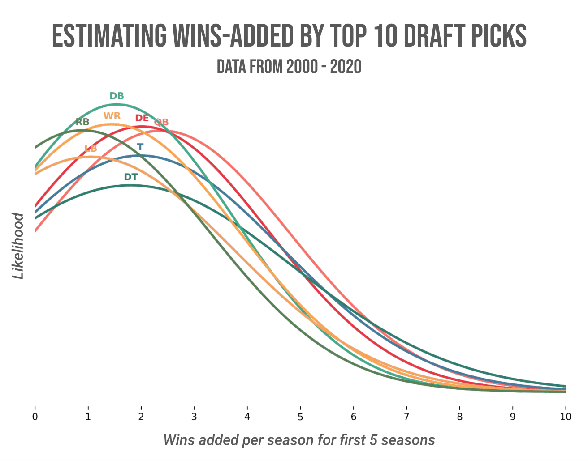

# Looking at the impact of top draft picks by player position

<picture>
  
  
</picture>

## Intro and approach

Before the 2025 NFL Draft, I wanted to look at which positions had the most
impact on winning over the following years. I decided to use a very simple
approach: looking at the top 10 draft picks from 2000 - 2020, I wanted to see
how much their teams increased their win totals after drafting them.

For each team, I used their team’s previous 2 yrs of performance as a baseline,
and looked at their winning percentage after drafting these positions.

## The analysis

See the Python notebook for how I looked at the data and generated some graphs.

You can get the Conda environment to run as a kernel for the notebook by
running `install_conda.sh`.

## The results

Obviously variance in this, but shows that if you are looking for real change in
an org (adding 4-5 wins), it's done with QB, on the offensive or defensive
lines, or DB/WRs. Drafting RB or LB doesn't cut it.

Another obvious thing: you can't actually pin the increase in wins on one
player, especially in an NFL roster of 50+ men. Likely, there is a lot of
correlation shown in these results, not causation.

But at the end of the day, if I'm a GM, I'd like to at least be correlated with
winning team decisions, even if they may not be causing wins.

## On socials

Shared these posts on [Reddit][reddit] and Twitter/X. Follow me at
[x.com/AkhilRaju92](https://x.com/AkhilRaju92).

[reddit]: <https://www.reddit.com/r/NFL_Draft/comments/1k634w4/impact_of_top_draft_picks_by_player_position/>
